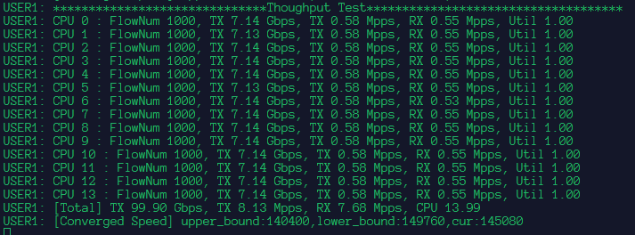
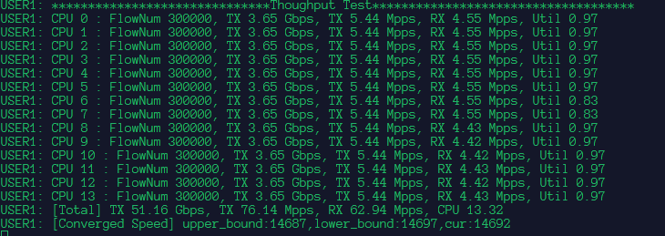
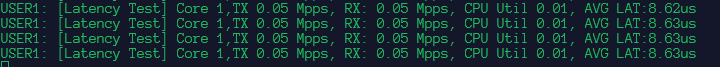

# BiTester

#### 介绍
基于DPDK的双向UDP流生成器，用于测试网卡、NF、网络的吞吐量以及时延，主要包括bps、pps、latency等性能指标。很多测试工具都提供了比较复杂的功能，所以难免会出现性能损耗，因此实现了这个比较简单的打流器来辅助科研测试（其实是本人比较菜写不出复杂的。。。），灵感来源于Dperf。
* 带宽测试

    
* 包速率测试

    

* 时延测试

    

* 性能对比
    * 环境：
        * DPDK： 20.11
        * NIC: NVIDIA BF2/CX6 100GbE
        * CPU: Intel Core I7 16cores
        * RAM: 32G DDR4
        * PCIE: Gen4 x 16
    * PPS指标对比

        |单向测试|Client TX|Server RX|Cores|
        |---|---|---|---|
        |BiTester|117.83Mpps|69.68Mpps|14|
        |DPDK-Pktgen|109.96Mpps|19.8Mpps|14|

        |双向测试|Client TX|Client RX|Server RX|Server TX|Cores|
        |---|---|---|---|---|---|
        |BiTester|69.57Mpps|63.19Mpps|63.15Mpps|63.14Mpps|14|
        |Dperf|24.99Mpps|24.99Mpps|24.99Mpps|24.99Mpps|14|

#### 软件架构
1. CPU利用率计算
    * 为每个核配置两个变量，一个用于记录cpu运行总时间T_total，一个用于记录包处理消耗cpu时间T_task
        > cpuUtil=T_task/T_total*100%
    * DPDK采用轮询进行包处理，系统的cpu利用率不再准确，因此需要app自行计算
    
2. 发送速度收敛
    * 每隔一段时间（~1s）计算所有核心的CPU利用率并求和算出cpu总利用率cpuUtil；
    * 如果cpuUtil>queueNum*0.95,说明基本快要到达处理瓶颈，将此时的速度设为上界upper_bound；
    * 如果cpuUtil<queueNum*0.95,说明还未到达处理瓶颈，将此时的速度设为下界lower_bound；
    * 采用二分法计算下一次的发送速率，TX_Speed=(upper_bound+lower_bound)/2，主线程调节所有worker线程的发送速率；
    * 速率收敛后，如若此时cpuUtil>queueNum*0.95，lower_bound下调，重新收敛；
    * 速率收敛后，如若此时cpuUtil<queueNum*0.95，upper_bound上调，重新收敛；

3. 并发连接设计
    * 在每一个woker核心设置定时器，按照cps增加连接数flow_num；
    * 根据当前的包序号psn以及flow_num计算当前sip和sport,达到多流发送的目的  
        > thisFlow.src_ip = (psn % thisFlow.flow_num) / 65536 + flows->src_ip;

        > thisFlow.src_port = (psn % thisFlow.flow_num + flows->src_port) % 65536;

4. 时延测试
    * 定义一段时间T内,接收的报文总和为count,总cpuCycle为Cycle3;
    * 发送时，在每个UDP包内嵌入当前cpuCycle Cycle1;
    * 接收时，获取当前cpuCycle Cycle2, Cycle3+=Cycle2-Cycle1;
    * 该时间段的平均时延：AvgLat=Cycle3/CPUHZ/T
    * 时延探测包速率为0.05Mpps,这个速率接近sockperf测时延的发送速率；

#### 安装教程

1.  Server编译：
    * 安装DPDK 20.11、Meson、Ninja
    * meson build
    * ninja -C build 
2.  Client编译：
    * 安装DPDK 20.11
    * make
#### 使用说明

1.  Server运行指令：
    * 双向测试
        > ./build/l2fwd -a 01:00.0 -- -r 0 -t 0 -q 14 -reverse 
    * 单向测试
        > ./build/l2fwd -a 01:00.0 -- -r 0 -t 0 -q 14 -rxonly
    * Option:
        * -a: PCIE号
        * -r: rx port
        * -t: tx port
        * -q：queue amount
        * -rxonly: recv only
        * -reverse: swap 6元组（smac,dmac,sip,dip,sport,dport）
        
2.  Client运行指令
    * cd client/scripts 
    * 有bps、pps、lat的测试脚本
    * 运行命令
        > ../build/BiTester -a 01:00.1 -- -r 0 -t 0 -n 14 -f pps-test.conf 
    * Option:
        * -a: PCIE号
        * -r: rx port
        * -t: tx port
        * -q：queue amount
        * -f: 配置文件,用于调节并发连接数、cps、6元组信息。 

